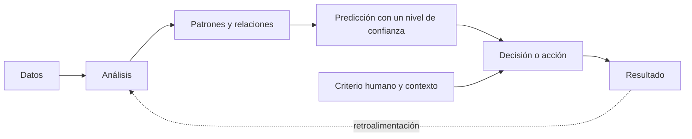
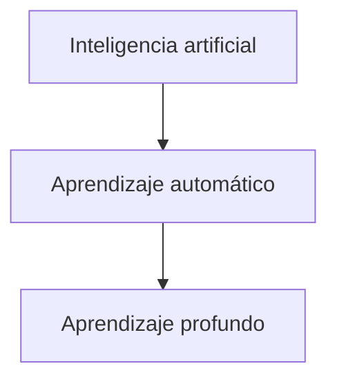
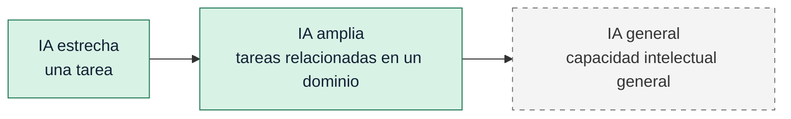
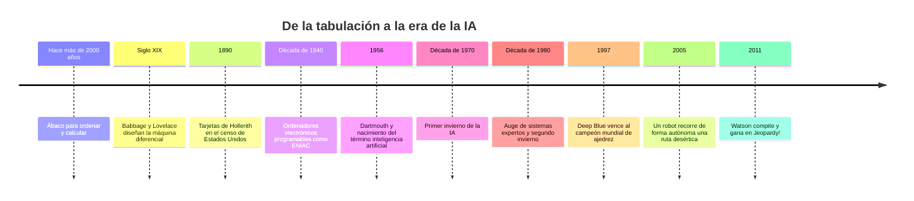
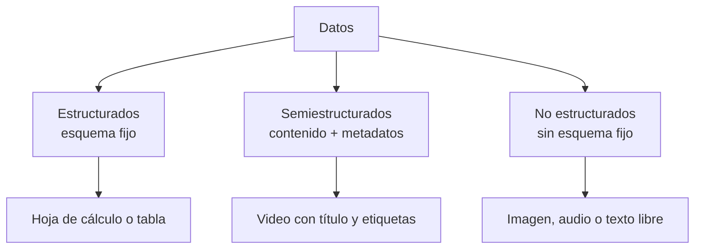
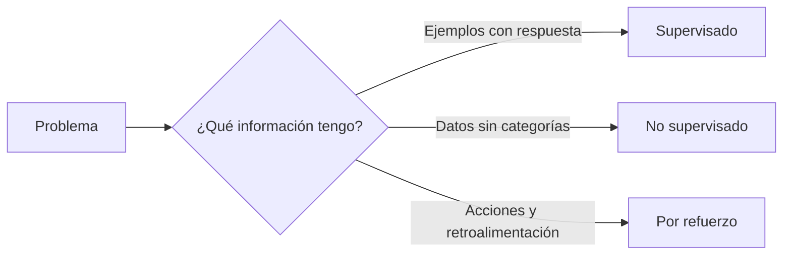

# Introducción a la Inteligencia Artificial - Cuaderno de apuntes

> [!NOTE]
> **Cómo está hecha esta nota**
>
> **Del material** resume y reorganiza lo que enseña el curso. **Explicación adicional** sirve para aterrizar las ideas con palabras y diagramas propios. Los cuestionarios y la evaluación final se usaron únicamente para reconocer qué conceptos se refuerzan; aquí no se guardan preguntas, opciones ni respuestas.

## Resumen de un minuto

**Del material**

La inteligencia artificial es la capacidad de una máquina para aprender patrones y hacer predicciones. No significa que la máquina piense como una persona: los servicios de IA calculan, analizan grandes volúmenes de datos y estiman qué es probable que ocurra. Su valor aumenta cuando complementa el juicio humano en lugar de pretender sustituirlo.

La historia de la informática puede entenderse en tres eras. En la **tabulación**, las máquinas ayudaban a ordenar información; en la **programación**, seguían instrucciones explícitas; en la **era de la IA**, los sistemas aprenden de los datos. Esto es especialmente útil porque gran parte de la información actual no cabe limpiamente en filas y columnas.

El aprendizaje automático puede trabajar de tres maneras: **supervisada**, con ejemplos etiquetados; **no supervisada**, encontrando agrupaciones en datos sin etiquetar; y **por refuerzo**, aprendiendo mediante ensayo, recompensa y penalización. Sus resultados suelen ser probabilísticos: ofrecen niveles de confianza, no verdades absolutas. Por eso, la decisión final y el contexto siguen necesitando criterio humano.

> [!TIP]
> **La idea que conecta todo el curso:**
>
> **Datos → análisis → patrones → predicción → decisión humana.**

## Mapa visual del curso

**Explicación adicional**

**Alternativa legible en GitHub para iOS**

- Datos → análisis → patrones y relaciones → predicción con un nivel de confianza → decisión o acción → resultado.
- El criterio humano y el contexto también intervienen en la decisión.
- El resultado aporta retroalimentación para realizar nuevos análisis.

---

## Módulo 1 - ¿Qué es la inteligencia artificial?

### La idea central

**Del material**

La IA combina informática y datos para resolver problemas. Aprende patrones, analiza información y hace predicciones. Puede estar presente en recomendaciones de compra, asistentes de voz, detección de fraude, reconocimiento visual, navegación y dispositivos de salud.

El curso insiste en una distinción importante: una máquina de IA no “piensa” en el sentido humano. Calcula. Incluso cuando el resultado parece inteligente, detrás hay análisis matemático de datos y una estimación de lo que probablemente sucederá.

### IA, aprendizaje automático y aprendizaje profundo

**Del material**

- **Inteligencia artificial:** es el campo más amplio. Puede incluir reglas programadas para ejecutar una tarea.
- **Aprendizaje automático o machine learning:** mejora su desempeño al exponerse a más datos y ajustar sus parámetros para reducir errores.
- **Aprendizaje profundo o deep learning:** utiliza varias capas de redes neuronales y puede aprender representaciones de los datos sin que una persona defina manualmente todas las características relevantes.

**Explicación adicional**

**Alternativa legible en GitHub para iOS**

- Inteligencia artificial
  - Aprendizaje automático
    - Aprendizaje profundo

No son tres tecnologías independientes. El aprendizaje profundo es una parte del aprendizaje automático, y el aprendizaje automático es una parte de la inteligencia artificial.

### IA frente a inteligencia aumentada

**Del material**

La inteligencia artificial busca que una máquina realice tareas asociadas con capacidades humanas. La inteligencia aumentada pone el énfasis en la colaboración: la tecnología procesa información o recomienda, y la persona conserva la decisión y aporta contexto.

Las máquinas tienen ventaja para procesar muchos datos, trabajar rápido, repetir tareas y detectar patrones. Las personas aportan creatividad, sentido común, empatía, comprensión del contexto y responsabilidad sobre la decisión.

> [!NOTE]
> **Ejemplo sencillo**
>
> Un sistema puede comparar miles de antecedentes médicos y estimar qué tratamiento tiene mayor probabilidad de funcionar. Eso no elimina el papel del médico: el profesional interpreta la recomendación, conoce al paciente y toma la decisión clínica.

### Análisis y predicción

**Del material**

- **Analizar** consiste en ingerir datos, clasificarlos, organizarlos y encontrar relaciones.
- **Predecir** consiste en utilizar ese análisis para estimar qué es probable que suceda.

El autocorrector es un buen ejemplo: compara lo escrito con patrones aprendidos de lenguaje y propone una corrección probable. No siempre acierta, pero puede ser útil si su precisión es suficientemente alta.

### Los tres niveles de IA

**Del material**

| Nivel | Alcance | Situación descrita en el curso | Ejemplos del material |
|---|---|---|---|
| IA estrecha | Una sola tarea o un dominio muy limitado. | Disponible actualmente. | Asistentes de voz, recomendaciones y ciertas funciones de vehículos. |
| IA amplia | Varias tareas relacionadas dentro de un proceso o dominio. | Es el nivel de uso empresarial actual según el curso. | Predicción del clima, seguimiento de pandemias y tendencias empresariales. |
| IA general | Cualquier tarea intelectual que pueda realizar una persona. | Se presenta como una posibilidad futura, no como una capacidad actual. | Razonamiento general, estrategia y creatividad comparables con las humanas. |

**Explicación adicional**

**Alternativa legible en GitHub para iOS**

IA estrecha —una tarea— → IA amplia —tareas relacionadas dentro de un dominio— → IA general —capacidad intelectual general planteada como posibilidad futura—.

### Lo que reforzó el cuestionario del módulo

- Definir la IA por lo que hace: aprende patrones, analiza y predice.
- No atribuir pensamiento humano a una máquina que está calculando.
- Distinguir IA de inteligencia aumentada por el papel que conserva la persona.
- Reconocer el alcance de la IA estrecha, amplia y general.
- Ubicar la IA general como una posibilidad futura, no como tecnología disponible hoy.

---

## Módulo 2 - Las tres eras de la informática

### De ordenar datos a aprender de ellos

**Del material**

La evolución no empieza con la IA. Durante siglos, las personas construyeron herramientas para ordenar información y descubrir patrones. Después llegaron los ordenadores programables, capaces de ejecutar distintas instrucciones. La IA abre una tercera etapa: en lugar de depender exclusivamente de reglas escritas de antemano, el sistema aprende de los datos.

| Era | Qué aporta la máquina | Ejemplos mencionados |
|---|---|---|
| Tabulación | Ordena y estructura datos para hacerlos comprensibles. | Ábaco, máquina diferencial y tarjetas perforadas de Hollerith. |
| Programación | Ejecuta instrucciones y programas definidos por personas. | ENIAC, computación espacial y ordenadores de propósito general. |
| Inteligencia artificial | Aprende patrones de los datos y hace predicciones. | Sistemas expertos, Deep Blue, vehículos autónomos y Watson. |

### Línea de tiempo para recordar

**Del material, condensado**

**Alternativa legible en GitHub para iOS**

Ábaco → máquina diferencial de Babbage y Lovelace → tarjetas de Hollerith en 1890 → ENIAC en la década de 1940 → Dartmouth en 1956 → inviernos de la IA → Deep Blue en 1997 → robot autónomo en 2005 → Watson en 2011.

### Los inviernos de la IA

**Del material**

La investigación vivió periodos de gran entusiasmo, seguidos por etapas de desilusión y reducción del financiamiento. El primer invierno llegó cuando la potencia de cálculo y el almacenamiento no alcanzaron para cumplir las expectativas. Más adelante, los sistemas expertos recuperaron el interés, pero también encontraron límites. La mejora del procesamiento y la disponibilidad de datos permitieron un nuevo impulso desde la década de 1990.

**Explicación adicional**

La lección histórica es útil para la master class: el avance de la IA no depende de una sola idea. Se acelera cuando coinciden **algoritmos**, **potencia de cómputo** y **datos suficientes**.

### Lo que reforzó el cuestionario del módulo

- Ordenar correctamente las eras: tabulación, programación e IA.
- Relacionar cada era con su forma de trabajar con los datos.
- Entender por qué la IA tuvo ciclos de auge e invierno.
- Recordar 1956 y Dartmouth como un punto de referencia del campo moderno.

---

## Módulo 3 - Datos estructurados, semiestructurados y no estructurados

### Los tres tipos de datos

**Del material**

| Tipo | Cómo reconocerlo | Ejemplos |
|---|---|---|
| Estructurado | Tiene un esquema claro y cabe en filas y columnas. Suele ser cuantitativo. | Fechas, direcciones, inventarios, reservaciones y transacciones. |
| No estructurado | No sigue un esquema fijo. Suele ser cualitativo y no se analiza bien con herramientas convencionales. | Imágenes, texto libre, audio, comentarios e historiales médicos. |
| Semiestructurado | Mezcla contenido libre con etiquetas o metadatos que ayudan a catalogarlo. | Un video acompañado por título, fecha, ubicación o hashtag. |

**Explicación adicional**

**Alternativa legible en GitHub para iOS**

- Datos
  - Estructurados: esquema fijo, como una tabla.
  - Semiestructurados: contenido acompañado por metadatos.
  - No estructurados: imágenes, audio o texto libre sin un esquema fijo.

### ¿Por qué son difíciles los datos no estructurados?

**Del material**

Cuando la información está organizada, localizar el valor mayor o comparar registros es relativamente directo. En datos no estructurados, la señal útil aparece mezclada con información irrelevante, distintos formatos, unidades y contextos. Un programa convencional necesitaría anticipar demasiadas reglas y excepciones.

El curso señala que alrededor del 80 % de los datos actuales son no estructurados. Allí pueden esconderse patrones valiosos para salud, seguridad, finanzas, tendencias de consumo y prevención de riesgos. El aprendizaje automático ayuda a dar estructura a esa información y a mejorar sus predicciones conforme aprende de más datos.

> [!NOTE]
> **Ejemplo propio**
>
> Una tabla con fecha, ciudad y temperatura es estructurada. Miles de comentarios que dicen “hoy hace muchísimo calor”, fotos de termómetros y audios de reportes forman datos no estructurados. Si además cada publicación tiene fecha, ubicación y etiquetas, el conjunto se vuelve semiestructurado.

### Lo que reforzó el cuestionario del módulo

- Clasificar datos por su organización, no por el tema que describen.
- Reconocer el papel de los metadatos en los datos semiestructurados.
- Explicar por qué el volumen y la variedad vuelven difícil el análisis no estructurado.
- Relacionar el aprendizaje automático con la extracción de patrones en datos oscuros.

---

## Módulo 4 - Aprendizaje automático y cálculo probabilístico

### Programación clásica frente a aprendizaje automático

**Del material**

Un programa clásico necesita reglas y rutas previstas. Funciona muy bien cuando las condiciones están claras y pueden enumerarse. El aprendizaje automático resulta útil cuando las variables cambian y hay demasiadas posibilidades para escribirlas una por una.

El ejemplo del curso es una ruta por una ciudad. Un sistema de aprendizaje automático no requiere almacenar todas las combinaciones posibles de calles y tráfico. Compara alternativas, observa cambios, prueba opciones y ajusta recomendaciones usando lo aprendido.

| Sistema determinista | Sistema probabilístico |
|---|---|
| Sigue reglas predefinidas. | Aprende relaciones a partir de datos. |
| Busca respuestas del tipo verdadero/falso o sí/no. | Produce probabilidades y niveles de confianza. |
| Es adecuado cuando el problema está bien definido. | Es útil cuando hay incertidumbre y variables cambiantes. |
| Ante una situación no prevista puede necesitar nuevas reglas. | Puede reajustar su estimación al recibir nuevos datos. |

### Una probabilidad no es una certeza

**Del material**

El aprendizaje automático puede expresar una conclusión como “hay un 84 % de confianza en que esta ruta será más rápida”. Eso no equivale a afirmar que siempre lo será. El resultado debe interpretarse junto con el riesgo, el contexto y las consecuencias de equivocarse.

**Explicación adicional**

Un 84 % de confianza puede ser suficiente para elegir una ruta, pero quizá no para decidir un tratamiento médico sin más evidencia. El número es el mismo; lo que cambia es el costo del error.

### La colaboración humano-máquina

**Del material**

La IA destaca al encontrar patrones. Las personas aportan imaginación, compasión, sentido común y comprensión del contexto. El sentido común humano tampoco es perfecto: puede contener prejuicios. A la vez, un sistema de IA puede heredar sesgos si sus datos o su entrenamiento no son adecuados. Las mejores decisiones equilibran las fortalezas y limitaciones de ambos.

### Lo que reforzó el cuestionario del módulo

- Diferenciar una regla determinista de una predicción probabilística.
- Interpretar un nivel de confianza sin convertirlo en certeza.
- Explicar cómo un modelo aprende y ajusta recomendaciones.
- Reconocer que la responsabilidad de una decisión de alto impacto no desaparece por usar IA.

---

## Módulo 5 - Tres formas de aprendizaje automático

### Comparación rápida

**Del material**

| Método | Datos de entrada | Cómo aprende | Para qué sirve |
|---|---|---|---|
| Supervisado | Ejemplos etiquetados. | Compara características con una respuesta conocida. | Clasificación y predicción. |
| No supervisado | Datos sin etiquetar. | Encuentra agrupaciones, similitudes y diferencias. | Exploración, segmentación y descubrimiento de patrones. |
| Por refuerzo | Interacción con un entorno y retroalimentación. | Prueba acciones; recibe recompensas o penalizaciones. | Aprender una estrategia o secuencia de acciones. |

### Aprendizaje supervisado

**Del material**

Necesita ejemplos donde el resultado correcto ya se conoce. Para enseñar a reconocer perros, se proporcionan imágenes etiquetadas como “perro” junto con sus características. Después del entrenamiento, el modelo clasifica imágenes nuevas según los patrones aprendidos.

**Clave:** alguien supervisa indirectamente el aprendizaje al proporcionar las etiquetas.

### Aprendizaje no supervisado

**Del material**

Recibe información sin una respuesta correcta previamente marcada. El algoritmo busca agrupaciones naturales. Puede, por ejemplo, detectar segmentos de clientes con comportamientos similares cuando todavía no sabemos qué categorías utilizar.

**Clave:** no adivina una etiqueta conocida; descubre estructura en los datos.

### Aprendizaje por refuerzo

**Del material**

Aprende mediante ensayo y error. Una acción favorable recibe una recompensa; una desfavorable, una penalización. Al repetir el ciclo, el sistema favorece las acciones que producen mejores resultados.

**Clave:** lo que guía el aprendizaje no es una colección de respuestas etiquetadas, sino la retroalimentación obtenida al actuar.

**Explicación adicional**

**Alternativa legible en GitHub para iOS**

- Ejemplos con una respuesta conocida → aprendizaje supervisado.
- Datos sin categorías previas → aprendizaje no supervisado.
- Acciones acompañadas de recompensas o penalizaciones → aprendizaje por refuerzo.

### Lo que reforzó el cuestionario del módulo

- Elegir el método según el tipo de datos y la retroalimentación disponible.
- No confundir etiquetas con recompensas.
- Asociar clasificación con aprendizaje supervisado.
- Asociar agrupación y segmentación con aprendizaje no supervisado.
- Asociar ensayo y error con aprendizaje por refuerzo.

---

## Módulo 6 - Cómo puede transformar la vida humana

### La visión planteada por el curso

**Del material**

El nivel actual se sitúa en la IA amplia: sistemas capaces de realizar varias tareas relacionadas dentro de un dominio. El curso presenta la IA general como una posibilidad futura vinculada con dispositivos, robots e Internet de las cosas. En esa visión, la tecnología podría ofrecer conocimientos más profundos, interacciones más naturales, mayor personalización y un planeta conectado mediante miles de millones de sensores.

Los sensores producirían grandes volúmenes de datos que podrían emplearse para mejorar seguridad, sostenibilidad y protección ambiental. Humanos, dispositivos y robots formarían una red capaz de anticipar necesidades, hacer predicciones y proponer soluciones.

> [!WARNING]
> **Qué pertenece a una proyección**
>
> La IA general y ese “cerebro digital” colectivo se presentan como escenarios futuros del curso. No deben confundirse con capacidades demostradas de los sistemas actuales.

### La relación ideal

**Del material**

La IA puede aumentar productividad, revelar conocimiento y personalizar servicios. La relación ideal no elimina al ser humano: combina capacidad de cálculo con juicio, empatía, creatividad y responsabilidad.

**Explicación adicional**

Una buena pregunta para evaluar cualquier uso de IA es: **¿qué hace mejor la máquina, qué debe decidir la persona y quién responde si el sistema se equivoca?**

### Lo que reforzó el cuestionario del módulo

- Repasar los tres niveles sin confundir presente y futuro.
- Identificar a la IA amplia como el nivel empresarial descrito por el curso.
- Entender la transformación como colaboración, no como reemplazo automático.
- Separar beneficios posibles de afirmaciones sobre capacidades actuales.

---

## Diferencias que no debo confundir

| Conceptos | Diferencia esencial |
|---|---|
| IA e inteligencia aumentada | La IA ejecuta o automatiza una capacidad; la inteligencia aumentada enfatiza que la máquina apoya a una persona que conserva la decisión. |
| IA, ML y DL | IA es el campo amplio; ML aprende de datos; DL es una forma de ML basada en múltiples capas de redes neuronales. |
| Análisis y predicción | Analizar encuentra estructura y relaciones; predecir estima un resultado futuro o desconocido. |
| Estrecha, amplia y general | Una tarea; varias tareas relacionadas en un dominio; capacidad intelectual general comparable con la humana. |
| Estructurado y semiestructurado | El primero tiene esquema fijo; el segundo mezcla contenido flexible con metadatos. |
| Semiestructurado y no estructurado | El semiestructurado contiene señales organizativas; el no estructurado carece de un esquema consistente. |
| Determinista y probabilístico | Uno aplica reglas para llegar a una respuesta definida; el otro estima resultados con niveles de confianza. |
| Supervisado y no supervisado | El supervisado aprende de respuestas etiquetadas; el no supervisado descubre agrupaciones sin etiquetas. |
| Supervisado y por refuerzo | El primero aprende de ejemplos correctos; el segundo aprende de recompensas y penalizaciones obtenidas al actuar. |
| Predicción y decisión | La predicción es una estimación del modelo; la decisión incorpora contexto, riesgo, valores y responsabilidad. |

## Ejemplos importantes para explicar el tema con mis propias palabras

1. **Autocorrector:** analiza contexto y propone una palabra probable; demuestra que una predicción útil no necesita ser infalible.
2. **Navegación con tráfico:** compara rutas en tiempo real y actualiza probabilidades al cambiar las condiciones.
3. **Clasificación de imágenes:** con ejemplos etiquetados aprende a reconocer una categoría nueva; es aprendizaje supervisado.
4. **Segmentación de clientes:** encuentra grupos naturales sin categorías previas; es aprendizaje no supervisado.
5. **Agente que aprende una estrategia:** prueba acciones, recibe recompensas o penalizaciones y mejora; es aprendizaje por refuerzo.
6. **Apoyo médico:** la máquina identifica patrones en muchos casos; el profesional interpreta y decide considerando a la persona.
7. **Publicación en una red social:** el texto, audio o video puede ser no estructurado; fecha, ubicación y hashtags añaden estructura mediante metadatos.

## Qué recordar para la evaluación

**Del material, condensado**

- La IA aprende patrones y hace predicciones; no equivale a pensamiento humano.
- Los servicios de IA analizan datos y, con base en ese análisis, predicen.
- La IA agrega valor al juicio humano; una recomendación no reemplaza automáticamente la decisión.
- IA estrecha = una tarea; IA amplia = tareas relacionadas en un dominio; IA general = capacidad intelectual general futura.
- Las tres eras son tabulación, programación e inteligencia artificial.
- Los datos pueden ser estructurados, semiestructurados o no estructurados.
- Los metadatos ayudan a organizar datos semiestructurados.
- Gran parte de los datos actuales es no estructurada y no cabe en herramientas convencionales.
- El aprendizaje automático puede predecir, aprender y ajustar recomendaciones.
- Un resultado probabilístico expresa confianza, no certeza.
- Supervisado = etiquetas; no supervisado = agrupaciones sin etiquetas; refuerzo = ensayo, recompensa y penalización.
- Humanos y máquinas tienen fortalezas distintas; la colaboración suele producir mejores decisiones.

### Frases cortas para recuperar la idea bajo presión

- **IA:** encuentra patrones y predice.
- **Inteligencia aumentada:** la máquina apoya; la persona decide.
- **Datos semiestructurados:** contenido flexible más metadatos.
- **Probabilidad:** confianza, no certeza.
- **Supervisado:** aprende con respuesta conocida.
- **No supervisado:** descubre grupos.
- **Refuerzo:** aprende de las consecuencias.

## Para aprovechar la master class

Estas preguntas pueden servir para conectar el curso introductorio con casos reales:

1. ¿IBM utiliza “IA amplia” igual que otras fuentes utilizan “IA empresarial” o “IA de propósito específico”?
2. ¿Cómo se calibra y valida el nivel de confianza de una predicción?
3. ¿Qué cambia en un proyecto cuando predominan los datos no estructurados?
4. ¿Cómo se detectan etiquetas deficientes o sesgos en un conjunto de entrenamiento?
5. ¿Cuándo conviene un método determinista en lugar de un modelo de aprendizaje automático?
6. ¿Qué responsabilidades nunca deberían delegarse completamente en una predicción automática?
7. ¿Cómo se mide si la colaboración humano-máquina mejora realmente la decisión?

> [!TIP]
> **Preparación de 20 minutos antes de la clase**
>
> Lee el resumen de un minuto; explica sin mirar las tres eras, los tres tipos de datos y los tres métodos de aprendizaje; termina revisando la tabla “Diferencias que no debo confundir”. Si una explicación no sale en dos o tres frases, marca ese punto para preguntarlo en la master class.

## Alcance y fuente

- Fuente principal: contenido académico del curso **Introducción a la Inteligencia Artificial** de IBM SkillsBuild.
- Curso: [IBM SkillsBuild - Introducción a la Inteligencia Artificial](https://alm.ibm.com/ibm-skillsbuildadult/trainingId/course:4058918/trainingInstanceId/course:4058918_4630713/es-ES).
- Las visualizaciones Mermaid de esta nota son diagramas de estudio propios; no son imágenes copiadas del curso.
- No se transcribieron preguntas, opciones ni respuestas de cuestionarios o de la evaluación final.
