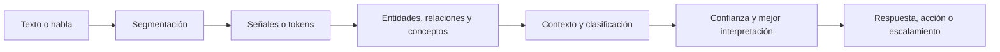
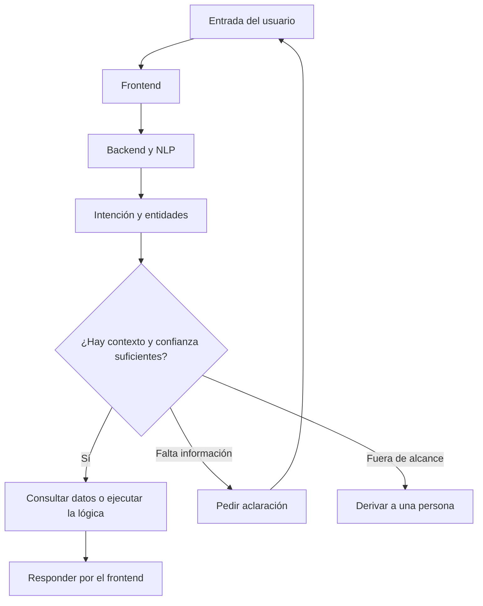
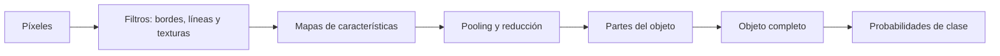
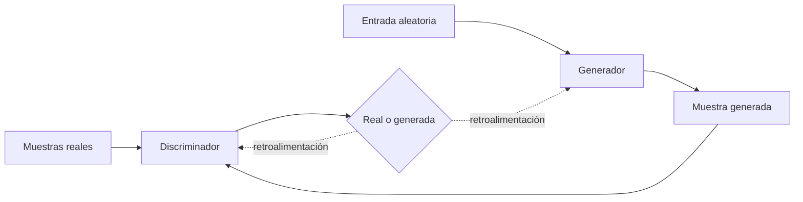

# Procesamiento del lenguaje natural y visión por ordenador - Cuaderno de apuntes

> [!NOTE]
> **Cómo está hecha esta nota**
>
> **Del material** resume y reorganiza lo que enseña el curso. **Explicación adicional** desarrolla ideas tomadas de los recursos oficiales que IBM enlaza al final o añade ejemplos propios para facilitar la comprensión. Los cuestionarios y la evaluación final se usaron solo para reconocer qué conocimientos se refuerzan; aquí no se guardan preguntas, opciones ni respuestas.

## Resumen de un minuto

**Del material**

El procesamiento del lenguaje natural o **NLP** permite que una máquina trabaje con texto y habla humana. Como el lenguaje es ambiguo y no estructurado, el sistema primero lo divide en oraciones y señales o *tokens*. Después identifica entidades, relaciones, conceptos, emociones e intención; compara interpretaciones posibles y elige la que reúne más evidencia, junto con un nivel de confianza.

Project Debater y Watson en *Jeopardy!* muestran la misma idea a distinta escala: comprender una entrada, buscar información en un corpus, generar posibilidades, ordenar la evidencia y responder. Ninguno “entiende” como una persona; ambos convierten lenguaje desordenado en representaciones que pueden analizarse matemáticamente.

Un chatbot aplica ese proceso dentro de un dominio limitado. Su **frontend** recibe y presenta mensajes; su **backend** interpreta la consulta. Allí, un clasificador relaciona muchas maneras de preguntar con pocas acciones posibles. La **intención** representa lo que el usuario quiere hacer, la **entidad** aporta los datos relevantes y el **diálogo** organiza cómo continúa la conversación.

La visión artificial hace algo comparable con imágenes. Una **CNN** recorre pequeños grupos de píxeles con filtros, aprende desde rasgos simples hasta objetos completos y clasifica lo que observa. Una **GAN** enfrenta un generador con un discriminador: uno produce muestras y el otro intenta distinguirlas de las reales; ambos mejoran de forma iterativa. Estas técnicas permiten reconocimiento, inspección, análisis médico, OCR, creación de imágenes y muchas otras aplicaciones.

> [!TIP]
> **La idea que conecta todo el curso**
>
> **Entrada no estructurada → señales o rasgos → patrones y contexto → clasificación con confianza → respuesta o acción.**

## Vista general del procesamiento de lenguaje

**Explicación adicional**

**Alternativa legible en GitHub para iOS**

1. La persona escribe o habla.
2. El sistema divide la entrada en oraciones y señales.
3. Reconoce entidades, relaciones, conceptos y señales emocionales.
4. Usa el contexto para clasificar posibles significados.
5. Ordena las posibilidades por evidencia y confianza.
6. Responde, ejecuta una acción o deriva el caso a una persona.

---

## Módulo 1 - El proyecto Debater

### Qué demuestra Project Debater

**Del material**

IBM inició Project Debater para investigar si una máquina podía hacer más que responder preguntas aisladas. El reto era escuchar argumentos humanos, construir una postura coherente, usar evidencia y responder al oponente durante una conversación continua.

El propósito no se reducía a “ganar”. La meta más útil era desarrollar un sistema capaz de ayudar a las personas a examinar asuntos complejos con evidencia y menos prejuicios, especialmente cuando no existe una respuesta obvia.

### Los cuatro pasos de un debate

**Del material**

| Paso | Qué necesita hacer el sistema |
|---|---|
| 1. Aprender y comprender el tema | Ingerir un corpus muy grande, estructurar su contenido y relacionar conceptos aunque estén expresados de maneras distintas. |
| 2. Crear una posición | Seleccionar fragmentos relevantes y convertirlos en un argumento coherente, ordenado y gramaticalmente claro. |
| 3. Organizar las pruebas | Comprender el significado de los hechos, valorar su fuerza, agruparlos por temas y reajustar la selección cuando aparece información nueva. |
| 4. Responder al oponente | Escuchar argumentos y refutaciones, identificar lo que debe contestarse y producir una réplica que fortalezca la propia posición. |

Estos pasos reflejan cuatro capacidades de los sistemas cognitivos descritos en el curso:

- **Comprender:** transformar lenguaje en información utilizable.
- **Razonar:** relacionar ideas, extraer conceptos y valorar evidencia.
- **Aprender:** mejorar con nueva información, interacciones y resultados.
- **Interactuar:** responder a seres humanos dentro de una conversación.

### Qué aporta el video del debate

**Del material**

En la refutación sobre la subvención de la educación preescolar, Project Debater:

- reconoce el argumento concreto del oponente;
- separa la existencia de otras prioridades de la posibilidad de financiar esta política;
- apoya su postura con un ejemplo de ayudas al cuidado infantil;
- delimita la propuesta como un mecanismo específico, no como una ayuda indiscriminada;
- utiliza una secuencia comprensible: objeción, respuesta, evidencia y conclusión.

Lo importante para el curso no es adoptar esa postura política, sino observar que el sistema mantiene el hilo del debate, selecciona evidencia y produce una respuesta relacionada con lo que acaba de escuchar.

> [!IMPORTANT]
> **Qué no debe confundirse**
>
> Hablar con soltura no demuestra comprensión humana ni garantiza que el argumento sea verdadero. El sistema organiza lenguaje y evidencia según sus modelos; la calidad depende del corpus, la clasificación, las fuentes y la forma de evaluar los resultados.

### Lo que reforzó el cuestionario del módulo

- Relacionar un debate con las capacidades de comprender, razonar, aprender e interactuar.
- Reconocer la función de un corpus como base documental del sistema.
- Entender que una respuesta coherente requiere selección y organización de evidencia, no solo búsqueda de palabras.
- Distinguir la finalidad de apoyar decisiones de la simple meta de derrotar a una persona.

---

## Módulo 2 - La IA realiza el procesamiento del lenguaje natural

### Por qué el lenguaje es difícil para una máquina

**Del material**

Los ordenadores trabajan con comodidad cuando los datos tienen campos y etiquetas predecibles. El lenguaje humano, en cambio, contiene dobles sentidos, pronombres, metáforas, expresiones culturales, errores, palabras con varios significados y relaciones que no siempre se escriben de manera explícita.

La frase humorística de Groucho Marx sobre un elefante “en pijama” funciona porque la misma estructura admite más de una interpretación. Una persona usa experiencia y contexto casi sin notarlo; una máquina necesita descomponer la frase y comparar interpretaciones.

### Segmentación y señales

**Del material**

El primer paso es trabajar con una oración a la vez: **segmentación de oraciones**. Después, el sistema divide la oración en unidades pequeñas llamadas **señales** o *tokens*. Esas unidades pueden clasificarse y relacionarse para transformar lenguaje no estructurado en una representación más ordenada.

El curso distingue tres elementos:

| Elemento | Qué representa | Ejemplo sencillo |
|---|---|---|
| Entidad | Una persona, lugar, objeto u otro sustantivo relevante. | “Armen”, “vidrio”, “Austin”. |
| Relación | Una conexión significativa entre dos o más entidades o menciones. | “Él” se refiere a “Armen”. |
| Concepto | Una idea implícita aunque la palabra no aparezca literalmente. | Una referencia a disparar a un elefante puede activar conceptos como safari, cámara o rifle según el contexto. |

### Resolver referencias y contexto

**Del material**

En dos oraciones consecutivas, una persona entiende con facilidad que un pronombre puede referirse a alguien mencionado antes. Para NLP, esa asociación debe identificarse explícitamente. El mismo problema aparece cuando una palabra tiene varios sentidos: el lugar desde donde se envía un paquete puede sugerir si viajará por tren o por barco.

El sistema aprende observando muchos casos. Calcula con qué frecuencia aparecen ciertas palabras y contextos juntos, reduce errores con la experiencia y asigna un nivel de confianza a cada interpretación. La clasificación no se vuelve perfecta; se vuelve mejor fundamentada.

### Emoción y análisis de opinión

**Del material**

No son sinónimos:

- La **detección de emociones** intenta identificar una categoría concreta, como alegría, ira o miedo.
- El **análisis de opinión** sitúa el contenido en una escala de orientación o intensidad: positiva, negativa o neutra.

Una conversación de soporte puede ser negativa sin que la emoción dominante sea necesariamente ira. Separar ambas tareas permite responder de forma más adecuada.

### El problema de la clasificación

**Del material**

Clasificar consiste en decidir qué significado o categoría corresponde a una señal. Es más difícil que localizar palabras porque exige contexto. Una misma palabra puede funcionar de forma distinta en dos frases y una expresión gramaticalmente correcta puede seguir siendo ambigua.

La solución descrita por el curso es aprender de muchos ejemplos, medir asociaciones contextuales y ordenar interpretaciones por probabilidad. Un buen sistema no debería presentar una inferencia incierta como certeza: debe conservar su valor de confianza.

### Watson en Jeopardy!: del enunciado a la respuesta

**Del material y del video**

Watson debía trabajar con pistas llenas de juegos de palabras y referencias culturales. El proceso mostrado puede resumirse así:

1. Descomponer la pista en partes.
2. Buscar en millones de libros, artículos y documentos del corpus.
3. Generar miles de respuestas posibles.
4. Reunir y ponderar evidencia para cada posibilidad.
5. Puntuar y clasificar las respuestas según la confianza.
6. Responder casi de inmediato cuando la mejor posibilidad supera el criterio establecido.

La victoria en el concurso sirvió como demostración. El valor más amplio estaba en aplicar ese tipo de análisis a sectores que reciben más información de la que una persona puede revisar por sí sola.

### Flujo moderno de NLP

**Explicación adicional - recurso oficial de IBM enlazado por el curso**

El recurso de ampliación de IBM organiza un flujo habitual en cuatro fases:

1. **Preprocesamiento:** tokenizar, normalizar y limpiar el texto; según la tarea, reducir variantes de palabras.
2. **Extracción de características:** convertir el texto en representaciones numéricas, desde conteos hasta *embeddings* contextuales.
3. **Análisis:** reconocer categorías gramaticales, entidades, dependencias, temas, sentimiento y significado.
4. **Entrenamiento y evaluación:** aprender patrones, medir errores, validar con datos no vistos y ajustar el modelo.

También ayuda a distinguir tres enfoques históricos:

- **Basado en reglas:** árboles y condiciones escritas a mano; útil en flujos previsibles, pero rígido.
- **Estadístico:** asigna probabilidades a interpretaciones y aprende asociaciones a partir de datos.
- **Aprendizaje profundo:** usa redes neuronales y grandes volúmenes de texto o voz para aprender representaciones más complejas.

Fuente de ampliación: [IBM - What is natural language processing?](https://www.ibm.com/think/topics/natural-language-processing).

### NLP y NLU

**Explicación adicional**

- **NLP** es el campo amplio que permite procesar, analizar y generar lenguaje.
- **NLU** o comprensión del lenguaje natural es una parte de NLP enfocada en interpretar significado, intención y contexto.

Tokenizar una oración pertenece a NLP; inferir qué intenta conseguir la persona se acerca más a NLU.

### Lo que reforzó el cuestionario del módulo

- Explicar por qué el lenguaje humano se considera información no estructurada.
- Ordenar el paso de oración a señales y de señales a una interpretación contextual.
- Distinguir entidad, relación y concepto.
- No confundir emoción con orientación positiva, negativa o neutra.
- Entender que la ambigüedad se reduce con ejemplos, contexto, frecuencia y niveles de confianza.
- Relacionar el éxito de Watson con la generación, puntuación y clasificación de respuestas posibles.

---

## Módulo 3 - NLP convierte señales en significado

### Qué puede y qué no puede hacer un chatbot

**Del material**

Un chatbot suele estar diseñado para un propósito concreto. Responde bien cuando la consulta pertenece a su dominio y tiene más dificultades cuando es ambigua o trata un tema ajeno. Esa limitación también es una ventaja: puede concentrarse en un conjunto pequeño de intenciones y ofrecer atención continua para preguntas repetitivas.

El curso describe a los chatbots como sistemas que trabajan bien con “datos pequeños”: por ejemplo, un bot de cine puede limitarse a títulos, ubicaciones y horarios. Una consulta fuera de ese alcance necesita aclaración o atención humana.

### Frontend y backend

**Del material**

| Parte | Función |
|---|---|
| Frontend | Es el canal de conversación. Recibe texto o voz y presenta la respuesta. |
| Backend | Contiene la lógica, interpreta la entrada, conserva el contexto necesario y decide cómo continuar. |

El frontend no es “la inteligencia” del chatbot; es la interfaz. El trabajo de relacionar lenguaje con acciones ocurre principalmente en el backend.

### Por qué se necesitan clasificadores

**Del material**

Una persona puede expresar la misma necesidad de muchas formas: decir que olvidó su contraseña, que no puede iniciar sesión, que el sistema la rechaza o escribir con errores. Un programa rígido necesitaría una condición exacta para cada frase.

Un **clasificador** aprende a correlacionar muchas formulaciones con un número pequeño de respuestas o acciones. Si la confianza es insuficiente o el caso no está contemplado, el diseño debe enviar la conversación a una persona.

### Intenciones, entidades y diálogo

**Del material**

| Concepto | Pregunta que responde | Forma útil de recordarlo |
|---|---|---|
| Intención | ¿Qué quiere conseguir la persona? | Acción o propósito; se parece a un verbo. |
| Entidad | ¿Sobre quién o qué se realiza la acción? | Persona, lugar, objeto, fecha u otro dato; se parece a un sustantivo. |
| Diálogo | ¿Cómo debe avanzar la conversación? | Árbol o flujo de respuestas y siguientes pasos. |

En una consulta sobre el horario del restaurante de Austin, abrir o consultar horario es la intención; Austin es una entidad. El diálogo decide si ya puede responder o si necesita preguntar por la fecha, la sucursal u otro dato.

### Flujo de un chatbot

**Explicación adicional**

**Alternativa legible en GitHub para iOS**

- Entrada del usuario → frontend → backend con NLP.
- El backend clasifica la intención y extrae entidades.
- El diálogo comprueba si tiene datos suficientes.
- Si los tiene, consulta el servicio o conocimiento necesario y responde.
- Si faltan datos, solicita una aclaración.
- Si el caso excede su alcance o tiene baja confianza, lo deriva a una persona.

### Ejemplo de Staples

**Del material**

En el ejemplo del curso, el frontend recibe una petición para volver a comprar bolígrafos negros. El backend usa NLP para inferir la intención, consulta el historial del cliente mediante servicios del negocio y ayuda a repetir el pedido. El bot conoce pocas tareas, pero las ejecuta de forma consistente y permanente, liberando al personal para casos menos repetitivos.

### Chatbot tradicional, chatbot con IA, asistente y agente

**Explicación adicional - recurso oficial de IBM enlazado por el curso**

| Sistema | Rasgo principal | Alcance típico |
|---|---|---|
| Chatbot tradicional | Reglas, palabras clave y flujos programados. | Preguntas previsibles y tareas cerradas. |
| Chatbot con IA | NLP/NLU, aprendizaje automático y, en algunos casos, modelos generativos. | Más formas de preguntar y conversación con contexto. |
| Asistente de IA | Combina conversación con ayuda en varias herramientas o actividades personales y laborales. | Calendario, búsquedas, contenido y distintas aplicaciones. |
| Agente de IA | Puede planificar y ejecutar flujos de varios pasos utilizando herramientas. | Objetivos más amplios con decisiones acotadas y menor intervención paso a paso. |

La conversación no basta para definir a un agente. Un chatbot responde dentro de una interacción; un agente se caracteriza por coordinar acciones para completar un objetivo.

Fuente de ampliación: [IBM - What is a chatbot?](https://www.ibm.com/think/topics/chatbots).

### Riesgos y buen diseño

**Explicación adicional**

- Informar claramente que se está interactuando con un sistema automático.
- Conectar el chatbot con fuentes fiables y mantenerlas actualizadas.
- Proteger la información que la conversación puede contener.
- Probar sesgos, errores y consultas fuera del dominio.
- Permitir una ruta clara hacia una persona cuando se necesita juicio, empatía o conocimiento especializado.
- Supervisar el desempeño; un bot útil hoy puede quedar desactualizado cuando cambian políticas o servicios.

### Lo que reforzó el cuestionario del módulo

- Reconocer el alcance limitado y especializado de un chatbot.
- Distinguir el canal de conversación de la lógica del backend.
- Explicar por qué un clasificador agrupa muchas formulaciones en pocas acciones.
- Identificar intención, entidad y diálogo por la función que cumplen.
- Relacionar NLP con la interpretación de lo que el usuario intenta conseguir.
- Recordar que los casos no comprendidos deben aclararse o escalarse.

---

## Módulo 4 - La IA clasifica las imágenes

### De píxeles a significado

**Del material**

Una imagen digital está formada por millones de píxeles cuyos valores representan color y luminosidad. Guardar o mostrar esos valores es relativamente directo; interpretar qué objeto forman es mucho más difícil. Analizar todos los píxeles a la vez puede ser impráctico, por lo que una CNN examina regiones pequeñas y combina lo aprendido de manera jerárquica.

### Cómo trabaja una CNN

**Del material y del video**

Una **red neuronal convolucional** o **CNN** es una arquitectura de aprendizaje profundo especializada en reconocer patrones visuales.

1. Un **filtro** o *kernel* pequeño, por ejemplo de 3 × 3, se desplaza sobre la imagen.
2. En cada posición compara el patrón del filtro con los valores de los píxeles y produce una puntuación.
3. El recorrido crea un **mapa de características** que señala dónde aparece ese patrón.
4. Varios filtros buscan bordes, ángulos, líneas, colores o texturas diferentes.
5. El **pooling** reduce las dimensiones y conserva las señales más importantes.
6. Las primeras capas detectan rasgos simples; las siguientes combinan esos rasgos en partes y objetos.
7. Las capas finales asignan probabilidades a las clases posibles.

**Alternativa legible en GitHub para iOS**

Píxeles → filtros para bordes y texturas → mapas de características → *pooling* → partes como ventana o puerta → objeto como casa → probabilidades de clase.

> [!NOTE]
> **Por qué una casa mal dibujada sigue pareciendo una casa**
>
> Las ventanas, el tejado y la puerta pueden cambiar de tamaño o forma, pero mantienen combinaciones de rasgos reconocibles. Una CNN aprende esas regularidades en lugar de memorizar una única distribución exacta de píxeles.

### Aplicaciones mencionadas para CNN

**Del material y del video**

- Reconocimiento y búsqueda visual.
- Detección y reconocimiento facial.
- OCR para texto escrito a mano o documentos escaneados.
- Imágenes médicas.
- Identificación de objetos y defectos.

### Cómo trabaja una GAN

**Del material y del video**

Una **red generativa adversarial** o **GAN** contiene dos submodelos:

- El **generador** crea una muestra falsa a partir de una entrada inicial, a menudo ruido aleatorio.
- El **discriminador** compara muestras y estima si pertenecen al conjunto real o fueron creadas por el generador.

Ambos reciben retroalimentación. Si el discriminador detecta la falsificación, el generador debe mejorar; si el generador lo engaña, el discriminador debe afinar su criterio. Después de muchas iteraciones, el generador puede producir muestras difíciles de distinguir de las reales. En tareas de imágenes, ambos submodelos pueden implementarse con CNN.

**Alternativa legible en GitHub para iOS**

1. El conjunto real entrena al discriminador para reconocer el dominio.
2. El generador crea una muestra.
3. El discriminador compara la muestra generada con las reales.
4. El error actualiza al modelo que falló.
5. El ciclo se repite hasta que las muestras son convincentes.

### Usos de GAN mencionados en el video

**Del material y del video**

- Crear imágenes y modelos visuales sintéticos.
- Predecir el siguiente fotograma de una secuencia.
- Mejorar la resolución de una imagen.
- Explorar esquemas de cifrado mediante entrenamiento adversarial.

> [!WARNING]
> **Una imagen convincente no es evidencia de realidad**
>
> La meta técnica del generador es producir una muestra que pase el criterio del discriminador. Eso no demuestra que la imagen represente un hecho real. La misma capacidad que sirve para datos sintéticos o restauración puede facilitar falsificaciones.

### Aplicaciones prácticas de visión artificial

**Del material**

El ejemplo central es la inspección de infraestructura con cámaras en drones. El sistema puede localizar grietas en un puente y ayudar a priorizar las que requieren reparación. El curso también propone:

- detectar un defecto difícil de ver en el ala de un avión;
- vigilar el flujo de agua en una granja para proteger cultivos cercanos;
- estimar el número de personas en una multitud;
- clasificar plantas y animales para medir biodiversidad;
- apoyar lectura labial;
- automatizar inspecciones donde observar manualmente sería lento o peligroso.

### Clasificación, detección y segmentación

**Explicación adicional - recurso oficial de IBM enlazado por el curso**

| Tarea | Qué responde | Resultado típico |
|---|---|---|
| Reconocimiento de imagen | ¿Qué elementos o acciones aparecen? | Identidades o descripciones generales. |
| Clasificación | ¿A qué clase pertenece la imagen? | Una o varias etiquetas con probabilidades. |
| Detección de objetos | ¿Qué objetos hay y dónde están? | Clase más cuadro delimitador. |
| Segmentación | ¿Qué píxeles pertenecen a cada clase u objeto? | Máscara con límites precisos. |
| Seguimiento | ¿Dónde está el mismo objeto en cada fotograma? | Trayectoria a través del video. |
| Comprensión de escena | ¿Cómo se relacionan los objetos? | Acciones, posiciones e interacciones. |
| OCR | ¿Qué texto contiene la imagen? | Caracteres o palabras en formato procesable. |

El recurso de IBM añade que un flujo habitual incluye reunir y etiquetar datos visuales, limpiar y normalizar las imágenes, elegir un modelo, entrenarlo, medir el error y ajustar los parámetros. La diversidad del conjunto de entrenamiento es decisiva para que el modelo funcione fuera de los ejemplos más cómodos.

Fuente de ampliación: [IBM - What is computer vision?](https://www.ibm.com/think/topics/computer-vision).

### CNN y GAN: la diferencia esencial

| Concepto | Función principal | Relación entre ambos |
|---|---|---|
| CNN | Extraer rasgos y reconocer o clasificar contenido visual. | Puede utilizarse sola para análisis visual. |
| GAN | Entrenar un generador contra un discriminador para producir muestras nuevas. | En imágenes, generador y discriminador suelen apoyarse en arquitecturas convolucionales. |

Una CNN no es “lo contrario” de una GAN. CNN describe un tipo de red útil para patrones espaciales; GAN describe una estrategia adversarial que coordina dos modelos.

### Lo que reforzó el cuestionario del módulo

- Explicar por qué mostrar píxeles no equivale a comprender una imagen.
- Relacionar filtros, mapas de características y capas con el reconocimiento visual.
- Identificar a CNN como la técnica central del curso para analizar imágenes.
- Distinguir el generador del discriminador en una GAN.
- Relacionar GAN con generación de muestras y CNN con extracción de patrones.
- Elegir visión artificial para inspección, reconocimiento y análisis de entradas visuales.

---

## Diferencias que no debo confundir

| Conceptos | Diferencia esencial |
|---|---|
| NLP y NLU | NLP es el campo amplio para procesar lenguaje; NLU se concentra en interpretar significado, intención y contexto. |
| Señal y entidad | Una señal es una unidad obtenida al segmentar; una entidad es una unidad identificada como persona, lugar, objeto u otro dato relevante. |
| Entidad y concepto | La entidad suele estar mencionada; el concepto puede estar implícito. |
| Entidad y relación | La entidad es un elemento; la relación conecta dos o más elementos o menciones. |
| Emoción y opinión | La emoción identifica una categoría afectiva; el análisis de opinión estima orientación o intensidad positiva, negativa o neutra. |
| Búsqueda y comprensión | Encontrar texto relacionado no basta; comprender exige clasificar el significado con contexto. |
| Respuesta y confianza | La respuesta es la mejor posibilidad elegida; la confianza expresa qué tan respaldada está, no que sea cierta. |
| Frontend y backend | El frontend conversa; el backend interpreta, conserva contexto y ejecuta la lógica. |
| Intención y entidad | La intención es el objetivo; la entidad aporta los datos sobre los que actúa. |
| Entidad y diálogo | La entidad es información extraída; el diálogo decide el siguiente paso. |
| Chatbot tradicional y chatbot con IA | El tradicional sigue reglas y flujos; el segundo interpreta lenguaje con modelos y tolera más variaciones. |
| Chatbot y agente de IA | El chatbot se centra en conversar; el agente puede planificar y ejecutar flujos de varios pasos mediante herramientas. |
| CNN y GAN | CNN reconoce patrones visuales; GAN coordina generador y discriminador para producir muestras. |
| Clasificación y detección | Clasificar asigna una clase; detectar añade la ubicación de cada objeto. |
| Detección y segmentación | La detección aproxima la ubicación con cuadros; la segmentación delimita píxeles. |
| Imagen real e imagen creíble | Que una imagen parezca real no demuestra que documente un acontecimiento real. |

## Ejemplos importantes para explicar el tema con mis propias palabras

1. **Frase ambigua:** una misma estructura puede atribuir el pijama a la persona o al elefante; muestra por qué el contexto importa.
2. **Pronombre:** vincular “él” con una persona mencionada antes es resolución de correferencia.
3. **Contraseña olvidada:** muchas frases y errores ortográficos pueden corresponder a una sola intención.
4. **Horario de restaurante:** consultar horario es la intención; la ciudad es una entidad; el diálogo pide los datos que falten.
5. **Watson en Jeopardy!:** genera candidatos, reúne evidencia y responde con base en confianza.
6. **Project Debater:** escucha una objeción, selecciona evidencia y formula una refutación conectada.
7. **Casa dibujada:** una CNN combina bordes y formas hasta reconocer ventanas, tejado y casa.
8. **Flor generada:** el generador intenta crearla y el discriminador aprende a detectar si es falsa.
9. **Puente inspeccionado por un dron:** la visión artificial localiza defectos y ayuda a priorizar riesgos.
10. **Compra repetida:** un chatbot interpreta la intención, consulta el historial y prepara una acción dentro de su dominio.

## Qué recordar para la evaluación

**Del material, condensado**

- NLP permite trabajar con lenguaje humano no estructurado.
- La segmentación separa oraciones y las señales dividen el contenido en unidades procesables.
- Una entidad representa una persona, lugar, objeto u otro elemento relevante.
- Una relación conecta entidades o menciones; un concepto puede estar implícito.
- El contexto ayuda a resolver palabras ambiguas y referencias.
- La detección de emociones clasifica emociones; el análisis de opinión mide orientación o intensidad.
- La clasificación aprende asociaciones a partir de muchos casos y nunca garantiza perfección.
- Un nivel de confianza no es una certeza.
- Project Debater aprende el tema, crea una postura, organiza evidencia y responde al oponente.
- Un corpus es la colección de documentos utilizada como base de conocimiento o entrenamiento.
- Watson descompone una pista, genera respuestas, pondera evidencia y clasifica por confianza.
- El frontend de un chatbot recibe y presenta mensajes; el backend realiza la interpretación y la lógica.
- Los clasificadores relacionan muchas formulaciones con pocas intenciones o respuestas.
- Intención = propósito; entidad = dato relevante; diálogo = flujo de la conversación.
- Los chatbots son útiles en dominios limitados y deben escalar lo que no comprenden.
- Una imagen está compuesta por valores de píxeles; interpretarla requiere extraer patrones.
- Una CNN aplica filtros sobre regiones pequeñas y aprende rasgos cada vez más abstractos.
- El *pooling* reduce dimensiones y conserva información relevante.
- En una GAN, el generador crea y el discriminador juzga.
- CNN analiza patrones; GAN genera muestras mediante competencia entre modelos.
- La visión artificial sirve para reconocimiento, inspección, OCR, imágenes médicas y otros análisis visuales.

### Frases cortas para recuperar la idea bajo presión

- **NLP:** convierte lenguaje en una representación que la máquina puede analizar.
- **Token:** fragmento procesable del texto.
- **Entidad:** quién, dónde o qué.
- **Intención:** para qué contacta la persona.
- **Diálogo:** qué debe ocurrir después.
- **Clasificación:** elegir significado o categoría con contexto y confianza.
- **CNN:** de píxeles a rasgos y de rasgos a clases.
- **GAN:** un modelo crea y otro intenta detectar la falsificación.

## Para aprovechar la master class

1. ¿Qué errores aparecen al tokenizar español informal, abreviaturas o mensajes con faltas de ortografía?
2. ¿Cómo se decide el umbral de confianza para responder o derivar una conversación?
3. ¿Qué diferencia práctica existe entre análisis de sentimiento, detección de emoción e intención?
4. ¿Cómo se evalúa si un chatbot realmente resuelve casos y no solo produce respuestas naturales?
5. ¿Qué información necesita conservar el backend para mantener contexto sin invadir privacidad?
6. ¿Cuándo conviene usar reglas y cuándo un clasificador aprendido?
7. ¿Qué efecto tiene un conjunto de imágenes poco diverso sobre una CNN?
8. ¿Cómo se valida una inspección visual cuando no se pueden tolerar falsos negativos?
9. ¿Qué controles permiten distinguir contenido sintético de evidencia visual auténtica?
10. ¿En qué tareas actuales se prefieren CNN y en cuáles se están usando transformadores de visión?

> [!TIP]
> **Preparación de 25 minutos antes de la clase**
>
> Explica sin mirar el flujo de NLP, dibuja el backend de un chatbot y compara CNN con GAN. Después revisa la tabla “Diferencias que no debo confundir”. Si una explicación no cabe en tres frases claras, conviértela en una pregunta para la master class.

## Alcance y fuentes

- Fuente principal: curso **Procesamiento del lenguaje natural y visión por ordenador** de IBM SkillsBuild, revisado completo desde **Acerca de este curso** hasta **Finalización del curso**.
- Curso: [IBM SkillsBuild - Procesamiento del lenguaje natural y visión por ordenador](https://alm.ibm.com/ibm-skillsbuildadult/trainingId/course:4058921/trainingInstanceId/course:4058921_4630716/es-ES).
- Videos y transcripciones del curso revisados: Project Debater, comprensión del lenguaje natural, Watson en *Jeopardy!*, redes neuronales convolucionales y redes generativas adversariales.
- Recursos enlazados por IBM: [NLP](https://www.ibm.com/think/topics/natural-language-processing), [chatbots](https://www.ibm.com/think/topics/chatbots) y [visión artificial](https://www.ibm.com/think/topics/computer-vision).
- Las tablas y visualizaciones Mermaid son recursos de estudio propios; no son imágenes copiadas del curso.
- No se transcribieron preguntas, opciones ni respuestas de cuestionarios o de la evaluación final.
